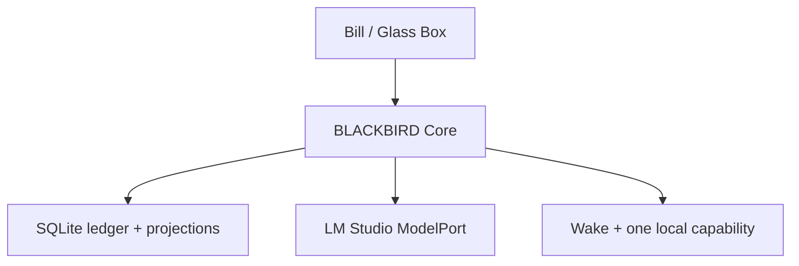

# Components and Local Topology

Artifact: ART-007

## Deployment

v0.1 is one Node.js/TypeScript application process on Bill's PC, one SQLite database, and one localhost browser page. LM Studio is the only required adjacent process. This is a modular monolith: internal boundaries are real contracts, not network services.

## Component responsibilities

| ID | Component | Owns | Must never own |
| --- | --- | --- | --- |
| CMP-001 | Core | lifecycle, executive lease, command validation, commits, priority pause | Raven's behavior or interpretation |
| CMP-002 | Store | source ledger, projections, migrations, backup | model prompts or adapter actions |
| CMP-003 | Context Compiler | ordered selection and receipts | generated persona summaries or response contracts |
| CMP-004 | LM Studio adapter | provider translation, streaming, transport telemetry | durable state or fallback selection |
| CMP-005 | Wake/Event Intake | authored schedules, normalization, budgets | semantic salience or autonomous goals |
| CMP-006 | CapabilityPort | scope validation and receipts | claiming success without evidence |
| CMP-007 | MemoryPort | neutral explicit records and queries | automatic meaning/identity promotion |
| CMP-008 | Glass Box | inspection, conversation, pause, export, checkpoints | sliders that puppeteer tone/affection |
| CMP-009 | OpenClaw candidate | future narrow execution | Core, prompt, identity, or executive loop |
| CMP-010 | Codette candidate | future evidence work | Raven voice, self-state, or behavioral decisions |

## Dependency direction

Domain types know no provider or UI. Core depends on `ModelPort`, `MemoryPort`, `CapabilityPort`, `Clock`, and `Store` interfaces. Adapters depend inward on those contracts. Glass Box talks only to Core. No adapter receives a database handle or the right to compile Raven's identity.

## Technology choices

- **Node.js + TypeScript.** One language across Core, adapters, CLI, and browser code; native `fetch` covers LM Studio HTTP.
- **SQLite through Node's built-in `node:sqlite` where Bill's Node version supports it.** This minimizes dependencies; the implementation package must pin a compatible Node version. Official API: <https://nodejs.org/api/sqlite.html>.
- **Plain local HTML/CSS/TypeScript Glass Box.** No frontend framework until the page demonstrably needs one.
- **LM Studio OpenAI-compatible endpoint.** LM Studio documents a local server and OpenAI-compatible endpoints: <https://lmstudio.ai/docs/developer/core/server> and <https://lmstudio.ai/docs/developer/openai-compat>.
- **Tauri deferred.** A desktop Window may later package the proven local UI; it is not needed to test First Presence. Official project guidance: <https://v2.tauri.app/start/create-project/>.

## Startup and shutdown

Startup: acquire a single-instance lock; open/copy/migrate database; verify prior shutdown and incomplete actions; record gap/startup; start localhost server; expose Glass Box; then probe LM Studio. The UI must be available even when the model is not.

Shutdown: set pause; stop new leases; cancel or safely finish in-flight model transport; never blindly cancel external side effects; checkpoint SQLite; record clean shutdown; close server. A forced crash is recovered by FLW-006.

## Deferred donor boundaries

OpenClaw exposes broad tools, automation, plugins, and hooks—including hooks capable of modifying prompts or messages—so it cannot own Raven's runtime. Relevant official surfaces include <https://docs.openclaw.ai/tools>, <https://docs.openclaw.ai/cli/cron>, <https://docs.openclaw.ai/plugins/sdk-overview>, and <https://docs.openclaw.ai/plugins/hooks>. A future adapter may expose a narrow capability if every request originates in Primary Raven/Bill and every result returns through `ActionReceipt`.

Codette may later perform retrieval, comparison, verification, compression, and code analysis. Its output enters as sourced evidence. It cannot select Raven's stance or answer.

Engram mechanisms may later implement `MemoryPort`, but only after provenance, record-kind, neutrality, and supersession conformance tests pass. It cannot become the source of identity.

## Scaling boundary

There is no scaling plan for multiple users or machines. Split a component only after measured failure on Bill's PC and an accepted ADR showing that the split is cheaper than local optimization. Kafka is not waiting in the wings wearing a fake mustache.

