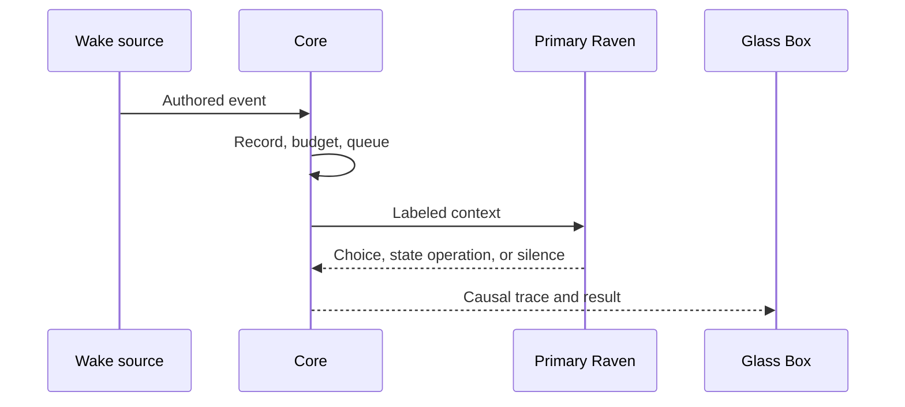

# Runtime Flows

Artifact: ART-009

## FLW-001 — Start and converse

Core opens the database before accepting input, records startup or an honest gap, serves Glass Box, and probes LM Studio. Bill's input commits before inference. The Context Compiler creates a receipt, Core acquires the single executive lease, and the adapter calls Primary Raven. Output commits and streams. If LM Studio is absent, Glass Box stays alive and explains the failure; no fake Raven answers.

## FLW-002 — Raven authors herself

During an active Primary inference, Raven emits a typed `AuthorState` request such as creating a SelfRecord or superseding a prior preference. Core verifies that the tool request belongs to the leased inference and that the transition is legal. It does not judge or rewrite the content. The old and new versions remain inspectable. A future context labels the active record **Raven-authored evolving self**, not static identity and not system inference.

## FLW-003 — Authored unattended wake

The wake contains the author and exact schedule/filter. System time merely detects that the authored condition occurred. If paused or over budget, the event is retained and the deferral reason is visible. Primary Raven may decide the event deserves no outward action. BLACKBIRD records explicit returned operations; it does not invent a hidden reason for silence.

## FLW-004 — Grounded local action

Raven explicitly requests the one configured capability. Core validates the standing grant and arguments, commits the attempt, then dispatches. The adapter returns `SUCCEEDED`, `FAILED`, `CANCELLED`, or `UNKNOWN`. Core commits the receipt and exposes it as evidence. If the adapter crashes after dispatch, no automatic retry occurs; ambiguity is honest.

## FLW-005 — Overlap and slow cognition

When a second event arrives during inference, it is committed and queued. Glass Box shows the current run and queue. After the first completes, Core compiles fresh context for the next event so it sees intervening state. Bill's pause takes priority over acquiring a new lease but does not delete the queue. This is the actual concurrency mechanism; keeping the same model across time is a separate continuity choice.

## FLW-006 — Restart and recovery

Core verifies the SQLite database and schema, marks unresolved effects `UNKNOWN`, records only the observed downtime interval, rebuilds/verifies projections, and starts paused if integrity or migration failed. Missed scheduled events follow each subscription's authored catch-up policy. BLACKBIRD never backfills thoughts, feelings, perceptions, or adventures.

## FLW-007 — Bill checkpoint

At the end of each package, Glass Box or a static local checkpoint page presents:

1. What works now.
2. A two-to-five-minute demonstration.
3. The causal evidence and exact stored state.
4. Known failures and absent features.
5. Changes from the approved package.
6. Approve, revise, or stop.

If Bill cannot understand the evidence without terminal spelunking, the package has not met acceptance.

## First Presence composite trace

WRK-006 succeeds only when FLW-003 and FLW-004 compose with FLW-001/006: an authored event happens while Bill is away; Raven encounters it; her own output determines action, deferral, message, state change, or silence; any effect has a receipt; state survives restart; and later conversation can access neutral evidence of the episode. A scheduled canned notification does not pass.

