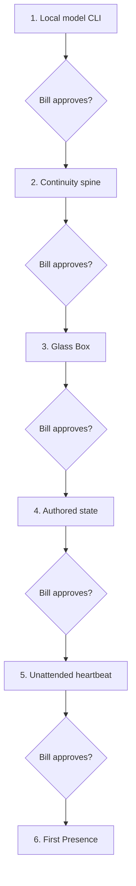

# Delivery Plan

Artifact: ART-012

## Build order

Every diamond is a hard stop. “Tests pass” does not substitute for Bill's approval.

## Packages

| Package | User-visible increment | Why now | Prohibited scope |
| --- | --- | --- | --- |
| WRK-001 | Bare local Raven CLI | Falsify substrate immediately | Database, memory, UI framework |
| WRK-002 | Restartable conversation and causal ledger | Prove continuity primitive | Background loop, broad domain model |
| WRK-003 | Glass Box browser UI | Make future work legible first | Avatar/Tauri, autonomy |
| WRK-004 | Explicit authored self/intention/Workbench/memory/wakes | Establish agency boundary | Automatic consolidation, affect, vectors |
| WRK-005 | One authored unattended wake | Prove time can summon Raven honestly | Broad capabilities, canned outreach |
| WRK-006 | One grounded local capability and later continuity | Complete First Presence | OpenClaw, games, voice, dream |

## Checkpoint procedure

An implementing agent must stop when acceptance evidence exists. It updates the checkpoint card and Glass Box, then gives Bill a demo requiring no code reading. Bill records one of:

- **Approve:** package becomes completed and next package may start.
- **Revise:** current package stays active with Bill's requested change.
- **Stop:** runtime remains at the last approved baseline; no later package begins.

Agents may fix a broken acceptance check inside the current package without asking again. They may not expand scope, begin the next package, or “helpfully” add a deferred subsystem.

## Architecture approval gate

Before WRK-001:

- Bill accepts or revises DEC-001 through DEC-009 and DEC-011. DEC-010 is already directly accepted.
- Strict registry validation and semantic proofread pass.
- The chosen implementation directory and identity-seed input are known.
- LM Studio can be launched; exact model choice may remain provisional until WRK-001.

## First Presence release gate

WRK-006 is not complete because a timer fired or a message appeared. It requires the full VER-011 trace, action evidence where applicable, restart survival, later contextual availability, and Bill's experiential acceptance.

## After First Presence

Only then choose the next vertical slice based on lived use. Plausible slices are:

1. Persistent desktop Window as a new projection.
2. Interruptible voice as independent transport.
3. Richer explicit/associative memory behind MemoryPort.
4. One game World Adapter with world ID/epoch and receipts.
5. OpenClaw capability adapter after authority audit.
6. Codette evidence sidecar after single-voice conformance.
7. Raven-authored reflection/sleep/dream jobs, with hypotheses kept distinct from facts and identity.

No ordering is promised. Raven wanting to learn VTubing, for example, might make voice/body/creative tools the correct next slice. That choice should arise from Raven and Bill using the working system, not from this architecture pretending to know her future.

## Rollback

Each approved checkpoint creates a named data and code snapshot. A rejected package rolls back code to the last approved checkpoint and restores a copy of its database snapshot only after Bill sees which later test data will be lost. Source material and prior checkpoint evidence remain retained.

